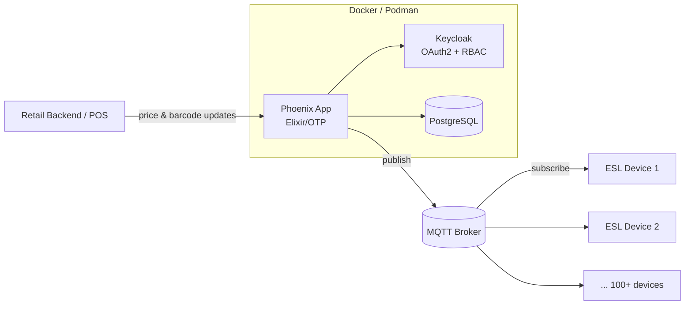

---

## 👨‍💻 About Me

I'm a **Software Engineer** who builds **systems that run in the real world** — live IoT fleets, secure containerised platforms, defence-grade algorithms, and AI tools that make business decisions faster.

- 🔭 **Now:** Building real-time retail automation at **Rebhu Computing** — Elixir/Phoenix, MQTT, Docker, local LLMs
- 🛡️ **Before:** Led **defence software projects with the Ministry of Defence** at Yottec System — real-time algorithms and Python/AWS automation
- 🧩 **I care about:** clean architecture, fault tolerance, security-by-default, and shipping things that last
- 🌱 **Exploring:** distributed Elixir/OTP, event-driven architecture, and production use of local LLMs
- 🤝 **Open to:** backend / platform / IoT engineering roles, and collaboration on systems-heavy projects

> 💡 *I don't just write code — I architect solutions that scale, secure, and last.*

---

## 💼 Experience & Impact

<table>
<tr>
<td width="50%" valign="top">

### 🔹 Rebhu Computing Pvt. Ltd.
**Software Engineer** · *Feb 2026 – Present*

- ⚡ Architected **real-time price & barcode sync for 100+ Electronic Shelf Label (ESL) devices** over MQTT using Elixir/Phoenix — eliminating manual shelf updates
- 🔐 Shipped **secure containerised services** with Docker & Podman, protected by **Keycloak OAuth2 + RBAC**
- 🤖 Built an **AI-powered client targeting & ranking engine** with Python, Ollama (local LLM) and Streamlit — data stays on-prem

</td>
<td width="50%" valign="top">

### 🔹 Yottec System LLP
**Junior Engineer – Project Coordinator** · *Jan 2025 – Feb 2026*

- 🛡️ Led **defence software projects in collaboration with the Ministry of Defence**
- 🧮 Designed **real-time algorithms** for mission-critical workflows
- ☁️ Developed **Python + AWS automation tools** to cut repetitive manual work
- 📋 Ran **Agile/Scrum ceremonies** and implementation planning across teams

*Defence work details are confidential.*

</td>
</tr>
</table>

---

## 🚀 Tech Stack

**Languages**

**Frameworks & Libraries**

 

**Cloud, DevOps & Security**

 

**Databases**

**AI & Data**

---

## 🧠 Core Expertise

| Area | What I do |
|---|---|
| 🏗️ **Solution Architecture** | Microservices · Event-driven design · Distributed systems |
| ⚙️ **Backend Engineering** | REST APIs · Real-time IoT · System integration |
| ☁️ **Cloud Infrastructure** | AWS — EC2, Lambda, S3, DynamoDB, API Gateway, IAM |
| 🤖 **AI & Automation** | Local LLMs · NLP · Hybrid web crawling |
| 🔒 **Security** | OAuth2 · RBAC · Keycloak · Container hardening |
| 📋 **Delivery** | Agile/Scrum · Technical documentation · DSA |

---

## 🏗️ How I Build — Real-time ESL Pipeline

---

## 🚧 Featured Projects

<table>
<tr>
<td width="50%" valign="top">

### 🏷️ Retail ESL Automation
Real-time price & barcode sync across **100+ IoT shelf labels**, built on Elixir's fault-tolerant OTP model.

`Elixir` `Phoenix` `MQTT` `Docker`

</td>
<td width="50%" valign="top">

### 🎯 AI Client Targeting
LLM-powered client ranking that runs **fully local** with Ollama — private data never leaves the network.

`Python` `Ollama` `Streamlit`

</td>
</tr>
<tr>
<td width="50%" valign="top">

### 🛒 [Cubboard4u.com](https://cubboard4u.com)
Interactive e-commerce platform with a sleek UI and seamless shopping experience.

`React` `Node.js` `MongoDB` `Tailwind`

</td>
<td width="50%" valign="top">

### 🎨 AI Art Generator
Cloud-based AI art creator with NFT integration.

`Python` `AWS` `AI APIs`

</td>
</tr>
</table>

---

## 📊 GitHub Stats

---

## 🏅 Certifications & 🎓 Education

<table>
<tr>
<td width="50%" valign="top">

**Certifications**
- 🏅 Full Stack Web Development — *Internshala*
- 🏅 Python Programming — *Mapping Skills Institute*
- 🏅 AWS Cloud Computing — *IIIT Institute*

</td>
<td width="50%" valign="top">

**Education**
- 🎓 **B.Tech, Computer Science & Engineering**
  Shambhunath Institute of Engineering and Technology, Prayagraj
  *2021 – 2024*

</td>
</tr>
</table>

---

### 🤝 Let's build something that scales

*"Building systems that don't just work — they scale, secure, and last."*

⭐ If you find my work useful, consider starring my repos!

