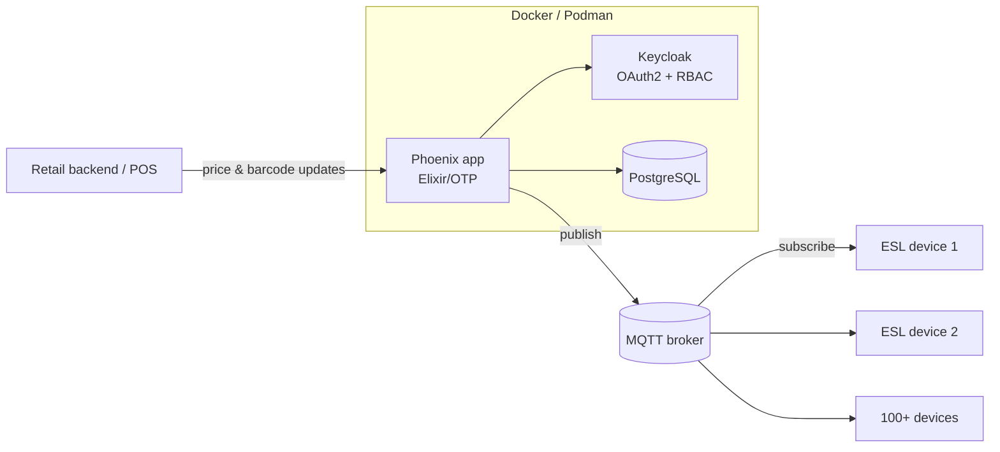
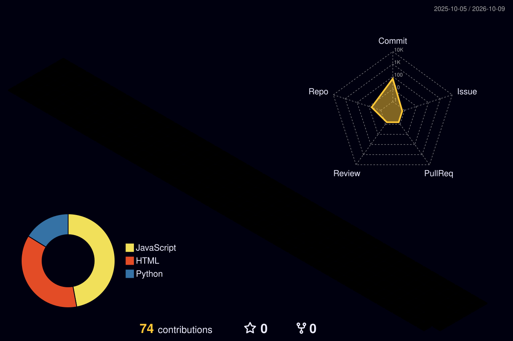

"""
setup_profile.py - ONE file that builds Sanjay Kumar's complete GitHub profile.

Creates:
  README.md                                  profile page
  assets/hero.svg                            3D rotating sphere banner (animated)
  assets/terminal.svg                        animated typing terminal
  .github/workflows/profile-3d.yml           daily 3D contribution graph

Usage (inside your zeus881/zeus881 repo):
  python setup_profile.py
  git add . && git commit -m "New profile" && git push
Then: Actions tab -> "3D contribution graph" -> Run workflow (once).
No extra libraries needed.
"""
import math, os

os.makedirs("assets", exist_ok=True)
os.makedirs(".github/workflows", exist_ok=True)

# ---------- geodesic sphere (icosahedron subdivided once) ----------
t=(1+5**.5)/2
V=[(-1,t,0),(1,t,0),(-1,-t,0),(1,-t,0),(0,-1,t),(0,1,t),(0,-1,-t),(0,1,-t),(t,0,-1),(t,0,1),(-t,0,-1),(-t,0,1)]
F=[(0,11,5),(0,5,1),(0,1,7),(0,7,10),(0,10,11),(1,5,9),(5,11,4),(11,10,2),(10,7,6),(7,1,8),
   (3,9,4),(3,4,2),(3,2,6),(3,6,8),(3,8,9),(4,9,5),(2,4,11),(6,2,10),(8,6,7),(9,8,1)]
def norm(p):
    l=math.sqrt(sum(c*c for c in p)); return tuple(c/l for c in p)
V=[norm(v) for v in V]; cache={}
def mid(a,b):
    k=tuple(sorted((a,b)))
    if k not in cache:
        V.append(norm(tuple((V[a][i]+V[b][i])/2 for i in range(3)))); cache[k]=len(V)-1
    return cache[k]
F2=[]
for a,b,c in F:
    ab,bc,ca=mid(a,b),mid(b,c),mid(c,a)
    F2+= [(a,ab,ca),(b,bc,ab),(c,ca,bc),(ab,bc,ca)]
E=set()
for f in F2:
    for i in range(3): E.add(tuple(sorted((f[i],f[(i+1)%3]))))
E=sorted(E)
CX,CY,R=790,172,128; N=40; DUR=18; TILT=math.radians(-22)
def proj(p,ang):
    x,y,z=p
    x,z = x*math.cos(ang)+z*math.sin(ang), -x*math.sin(ang)+z*math.cos(ang)
    y,z = y*math.cos(TILT)-z*math.sin(TILT), y*math.sin(TILT)+z*math.cos(TILT)
    s=1/(1-0.28*z)          # perspective
    return CX+x*R*s, CY+y*R*s, z, s
frames=[[proj(v,2*math.pi*k/N) for v in V] for k in range(N+1)]
f1=lambda v:f"{v:.1f}"
out=[]
A=f'dur="{DUR}s" repeatCount="indefinite"'
for a,b in E:
    ds=";".join(f"M{f1(fr[a][0])} {f1(fr[a][1])}L{f1(fr[b][0])} {f1(fr[b][1])}" for fr in frames)
    op=";".join(f"{0.12+0.55*((fr[a][2]+fr[b][2])/2+1)/2:.2f}" for fr in frames)
    out.append(f'<path class="e"><animate attributeName="d" values="{ds}" {A}/><animate attributeName="stroke-opacity" values="{op}" {A}/></path>')
for i in range(len(V)):
    cx=";".join(f1(fr[i][0]) for fr in frames); cy=";".join(f1(fr[i][1]) for fr in frames)
    r=";".join(f"{1.6+1.6*fr[i][3]*((fr[i][2]+1)/2):.2f}" for fr in frames)
    op=";".join(f"{0.25+0.75*(fr[i][2]+1)/2:.2f}" for fr in frames)
    hot = i%5==0
    cls="n hot" if hot else "n"
    blink=""
    if hot:
        d=(i*0.37)%3
        blink=f'<animate attributeName="fill" values="#8B83F0;#3FE0B5;#8B83F0" dur="3s" begin="{d:.2f}s" repeatCount="indefinite"/>'
    out.append(f'<circle class="{cls}"><animate attributeName="cx" values="{cx}" {A}/><animate attributeName="cy" values="{cy}" {A}/><animate attributeName="r" values="{r}" {A}/><animate attributeName="fill-opacity" values="{op}" {A}/>{blink}</circle>')
sphere="\n".join(out)

svg=f'''<svg xmlns="http://www.w3.org/2000/svg" viewBox="0 0 1000 344" width="1000" height="344" role="img" aria-label="Sanjay Kumar — Software Engineer. Backend, real-time IoT, cloud and AI automation.">
<defs>
 <linearGradient id="bg" x1="0" y1="0" x2="1" y2="1"><stop offset="0" stop-color="#0E1530"/><stop offset="1" stop-color="#071F26"/></linearGradient>
 <linearGradient id="name" x1="0" x2="1"><stop offset="0" stop-color="#B9B3FF"/><stop offset=".55" stop-color="#3FE0B5"/><stop offset="1" stop-color="#58A6FF"/>
  <animateTransform attributeName="gradientTransform" type="translate" values="-0.3 0;0.3 0;-0.3 0" dur="8s" repeatCount="indefinite"/></linearGradient>
 <radialGradient id="core"><stop offset="0" stop-color="#3FE0B5" stop-opacity=".95"/><stop offset=".4" stop-color="#3FE0B5" stop-opacity=".25"/><stop offset="1" stop-color="#3FE0B5" stop-opacity="0"/></radialGradient>
 <radialGradient id="halo"><stop offset=".55" stop-color="#7F77DD" stop-opacity=".18"/><stop offset="1" stop-color="#7F77DD" stop-opacity="0"/></radialGradient>
 <pattern id="grid" width="28" height="28" patternUnits="userSpaceOnUse"><path d="M28 0H0V28" fill="none" stroke="#ffffff" stroke-opacity=".035"/></pattern>
 <clipPath id="card"><rect width="1000" height="344" rx="18"/></clipPath>
</defs>

<g clip-path="url(#card)">
<rect width="1000" height="344" fill="url(#bg)"/>
<rect width="1000" height="344" fill="url(#grid)"/>
<circle cx="{CX}" cy="{CY}" r="200" fill="url(#halo)"/>

<!-- broker core + MQTT shockwaves -->
<circle cx="{CX}" cy="{CY}" r="34" fill="url(#core)"><animate attributeName="r" values="28;38;28" dur="3s" repeatCount="indefinite"/></circle>
<circle cx="{CX}" cy="{CY}" r="5" fill="#E9FFF8"/>
<g fill="none" stroke="#3FE0B5" stroke-width="1.4">
 <circle cx="{CX}" cy="{CY}" r="6"><animate attributeName="r" values="6;150" dur="3s" repeatCount="indefinite"/><animate attributeName="stroke-opacity" values=".8;0" dur="3s" repeatCount="indefinite"/></circle>
 <circle cx="{CX}" cy="{CY}" r="6"><animate attributeName="r" values="6;150" dur="3s" begin="1.5s" repeatCount="indefinite"/><animate attributeName="stroke-opacity" values=".8;0" dur="3s" begin="1.5s" repeatCount="indefinite"/></circle>
</g>
<!-- tilted orbit ring -->
<ellipse cx="{CX}" cy="{CY}" rx="182" ry="46" fill="none" stroke="#58A6FF" stroke-opacity=".45" stroke-dasharray="3 9" transform="rotate(-14 {CX} {CY})">
 <animate attributeName="stroke-dashoffset" values="0;-240" dur="10s" repeatCount="indefinite"/></ellipse>
<g transform="rotate(-14 {CX} {CY})"><circle r="4" fill="#58A6FF">
 <animateMotion dur="7s" repeatCount="indefinite" path="M{CX+182} {CY} a182 46 0 1 1 -364 0 a182 46 0 1 1 364 0"/></circle></g>

{sphere}

<!-- text -->
<g class="t">
 <text x="56" y="96" class="m" font-size="14" fill="#3FE0B5" letter-spacing="1">&gt; hello, world</text>
 <text x="54" y="160" font-size="58" font-weight="800" fill="url(#name)" letter-spacing="-1">Sanjay Kumar</text>
 <text x="56" y="198" font-size="20" fill="#E6E4FA" font-weight="600">Software Engineer</text>
 <text x="56" y="226" font-size="16" fill="#A9B4D0">Backend, real-time IoT, cloud and AI automation</text>
 <g class="m" font-size="13">
  <rect x="56" y="254" width="196" height="30" rx="15" fill="#3FE0B5" fill-opacity=".12" stroke="#3FE0B5" stroke-opacity=".5"/>
  <text x="74" y="274" fill="#3FE0B5">● Rebhu Computing</text>
  <rect x="264" y="254" width="256" height="30" rx="15" fill="#8B83F0" fill-opacity=".12" stroke="#8B83F0" stroke-opacity=".5"/>
  <text x="282" y="274" fill="#B9B3FF">Ministry of Defence projects</text>
 </g>
</g>
<text x="{CX}" y="326" text-anchor="middle" class="m" font-size="11" fill="#A9B4D0" fill-opacity=".7">mqtt broker → 100+ edge devices</text>
</g>
<rect x=".5" y=".5" width="999" height="343" rx="18" fill="none" stroke="#8B83F0" stroke-opacity=".25"/>
</svg>'''
open("assets/hero.svg","w",encoding="utf-8").write(svg)

# ---------- animated terminal ----------
lines=[("$ ","whoami",None),
 (None,"Sanjay Kumar, Software Engineer @ Rebhu Computing","#E6E4FA"),
 ("$ ","cat focus.txt",None),
 (None,"distributed backends | real-time IoT | secure cloud | local LLMs","#A9B4D0"),
 ("$ ","mqtt pub retail/esl/+/price --qos 1",None),
 (None,"✓ price + barcode synced to 100+ shelf labels","#3FE0B5"),
 ("$ ","git log --author=me --grep=defence --oneline",None),
 (None,"a1f3c9e  real-time algorithms for Ministry of Defence projects","#B9B3FF"),
 ("$ ","echo $MOTTO",None),
 (None,"Systems that scale, secure, and last.","#58A6FF")]
TOT=20.0; CW=8.4; y0=74; LH=24
t=0.6; body=[]
for i,(pr,txt,col) in enumerate(lines):
    y=y0+i*LH; x=28
    typing = pr is not None
    w=(len(txt)+(2 if pr else 0))*CW+6
    d = len(txt)*0.055 if typing else 0.15
    k0=t/TOT; k1=(t+d)/TOT
    t += d + (0.35 if typing else 0.55)
    content = (f'<tspan fill="#3FE0B5">{pr}</tspan><tspan fill="#E6E4FA">{txt}</tspan>' if pr else f'<tspan fill="{col}">{txt}</tspan>')
    body.append(f'''<clipPath id="c{i}"><rect x="{x}" y="{y-17}" height="24" width="0"><animate attributeName="width" values="0;0;{w:.0f};{w:.0f};0" keyTimes="0;{k0:.4f};{k1:.4f};0.97;1" dur="{TOT}s" repeatCount="indefinite"/></rect></clipPath>
<text x="{x}" y="{y}" clip-path="url(#c{i})">{content}</text>''')
term=f'''<svg xmlns="http://www.w3.org/2000/svg" viewBox="0 0 860 340" width="860" height="340" role="img" aria-label="Terminal: whoami — Sanjay Kumar, Software Engineer">

<rect x=".5" y=".5" width="859" height="339" rx="14" fill="#0E1530" stroke="#8B83F0" stroke-opacity=".3"/>
<path d="M.5 14.5a14 14 0 0 1 14-14h831a14 14 0 0 1 14 14v22H.5z" fill="#141D3E"/>
<circle cx="24" cy="19" r="6" fill="#FF5F57"/><circle cx="44" cy="19" r="6" fill="#FEBC2E"/><circle cx="64" cy="19" r="6" fill="#28C840"/>
<text x="430" y="24" text-anchor="middle" fill="#A9B4D0" style="font-size:12px">sanjay@zeus881: ~</text>
{chr(10).join(body)}
<text x="28" y="{y0+len(lines)*LH}" fill="#3FE0B5" opacity="0">$<animate attributeName="opacity" values="0;0;1;1;0" keyTimes="0;{t/TOT:.4f};{t/TOT+0.001:.4f};0.97;1" dur="{TOT}s" repeatCount="indefinite"/></text>
<rect x="46" y="{y0+len(lines)*LH-14}" width="9" height="17" fill="#3FE0B5"><animate attributeName="opacity" values="1;0;1" dur="1s" repeatCount="indefinite"/></rect>
</svg>'''
open("assets/terminal.svg","w",encoding="utf-8").write(term)

# ===================== README =====================
README = '''

 

## About me

I build **systems that run in the real world** — live IoT fleets, secure containerised platforms, defence-grade algorithms, and AI tools that help businesses decide faster.

- 🔭 **Now:** real-time retail automation at **Rebhu Computing** with Elixir/Phoenix, MQTT, Docker and local LLMs
- 🛡️ **Before:** led **defence software projects with the Ministry of Defence** at Yottec System
- 🧩 **I care about:** clean architecture, fault tolerance, and security by default
- 🌱 **Exploring:** distributed Elixir/OTP, event-driven architecture, local LLMs in production
- 🤝 **Open to:** backend, platform and IoT engineering roles and collaborations

## Experience & impact

<table>
<tr>
<td width="50%" valign="top">

### Rebhu Computing Pvt. Ltd.
**Software Engineer** · *Feb 2026 – Present*

- ⚡ Architected **real-time price & barcode sync for 100+ Electronic Shelf Labels** over MQTT with Elixir/Phoenix, removing manual shelf updates
- 🔐 Shipped **secure containerised services** on Docker & Podman behind **Keycloak OAuth2 + RBAC**
- 🤖 Built an **AI client targeting & ranking engine** with Python, Ollama and Streamlit that keeps data on-prem

</td>
<td width="50%" valign="top">

### Yottec System LLP
**Junior Engineer – Project Coordinator** · *Jan 2025 – Feb 2026*

- 🛡️ Led **defence software projects with the Ministry of Defence**
- 🧮 Designed **real-time algorithms** for mission-critical workflows
- ☁️ Built **Python + AWS automation tools** to cut repetitive manual work
- 📋 Ran **Agile/Scrum** ceremonies and implementation planning

Defence work details are confidential.

</td>
</tr>
</table>

## How I build: real-time ESL pipeline

## Tech stack

  

  

| Area | What I do |
|---|---|
| 🏗️ **Solution architecture** | Microservices, event-driven design, distributed systems |
| ⚙️ **Backend engineering** | REST APIs, real-time IoT, system integration |
| ☁️ **Cloud** | AWS: EC2, Lambda, S3, DynamoDB, API Gateway, IAM |
| 🤖 **AI & automation** | Local LLMs, NLP, hybrid web crawling |
| 🔒 **Security** | OAuth2, RBAC, Keycloak, container hardening |
| 📋 **Delivery** | Agile/Scrum, technical documentation, DSA |

## Featured projects

<table>
<tr>
<td width="50%" valign="top">

### 🏷️ Retail ESL automation
Real-time price & barcode sync across **100+ IoT shelf labels** on Elixir's fault-tolerant OTP.

`Elixir` `Phoenix` `MQTT` `Docker`

</td>
<td width="50%" valign="top">

### 🎯 AI client targeting
LLM-powered client ranking that runs **fully local** with Ollama, so private data never leaves the network.

`Python` `Ollama` `Streamlit`

</td>
</tr>
<tr>
<td width="50%" valign="top">

### 🛒 [Cubboard4u.com](https://cubboard4u.com)
Interactive e-commerce platform with a clean UI and smooth shopping flow.

`React` `Node.js` `MongoDB` `Tailwind`

</td>
<td width="50%" valign="top">

### 🎨 AI art generator
Cloud-based AI art creator with NFT integration.

`Python` `AWS` `AI APIs`

</td>
</tr>
</table>

## Contributions in 3D

## Certifications & education

<table>
<tr>
<td width="50%" valign="top">

- 🏅 Full Stack Web Development — *Internshala*
- 🏅 Python Programming — *Mapping Skills Institute*
- 🏅 AWS Cloud Computing — *IIIT Institute*

</td>
<td width="50%" valign="top">

🎓 **B.Tech, Computer Science & Engineering**
Shambhunath Institute of Engineering and Technology, Prayagraj
*2021 – 2024*

</td>
</tr>
</table>

### Let's build something that scales

*"Building systems that don't just work — they scale, secure, and last."*

'''
open("README.md", "w", encoding="utf-8").write(README)

# ===================== GITHUB ACTION =====================
WORKFLOW = '''name: 3D contribution graph

on:
  schedule:
    - cron: "0 18 * * *"   # daily
  workflow_dispatch:         # run manually from the Actions tab

permissions:
  contents: write

jobs:
  build:
    runs-on: ubuntu-latest
    steps:
      - uses: actions/checkout@v4

      - uses: yoshi389111/github-profile-3d-contrib@0.7.1
        env:
          GITHUB_TOKEN: ${{ secrets.GITHUB_TOKEN }}
          USERNAME: ${{ github.repository_owner }}

      - name: Commit the graph
        run: |
          git config user.name  "github-actions[bot]"
          git config user.email "41898282+github-actions[bot]@users.noreply.github.com"
          git add -A profile-3d-contrib
          git diff --cached --quiet || git commit -m "chore: update 3D contribution graph"
          git push
'''
open(".github/workflows/profile-3d.yml", "w", encoding="utf-8").write(WORKFLOW)

print("Done! Created README.md, assets/hero.svg, assets/terminal.svg, .github/workflows/profile-3d.yml")
