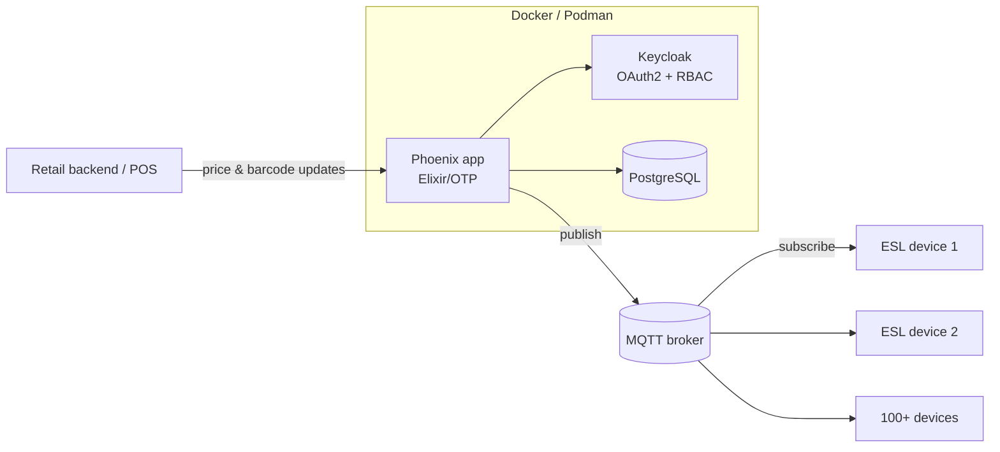

 

## About me

I build **systems that run in the real world** — live IoT fleets, secure containerised platforms, defence-grade algorithms, and AI tools that help businesses decide faster.

- 🔭 **Now:** real-time retail automation at **Rebhu Computing** with Elixir/Phoenix, MQTT, Docker and local LLMs
- 🛡️ **Before:** led **defence software projects with the Ministry of Defence** at Yottec System
- 🧩 **I care about:** clean architecture, fault tolerance, and security by default
- 🌱 **Exploring:** distributed Elixir/OTP, event-driven architecture, local LLMs in production
- 🤝 **Open to:** backend, platform and IoT engineering roles and collaborations

## Experience & impact

<table>
<tr>
<td width="50%" valign="top">

### Rebhu Computing Pvt. Ltd.
**Software Engineer** · *Feb 2026 – Present*

- ⚡ Architected **real-time price & barcode sync for 100+ Electronic Shelf Labels** over MQTT with Elixir/Phoenix, removing manual shelf updates
- 🔐 Shipped **secure containerised services** on Docker & Podman behind **Keycloak OAuth2 + RBAC**
- 🤖 Built an **AI client targeting & ranking engine** with Python, Ollama and Streamlit that keeps data on-prem

</td>
<td width="50%" valign="top">

### Yottec System LLP
**Junior Engineer – Project Coordinator** · *Jan 2025 – Feb 2026*

- 🛡️ Led **defence software projects with the Ministry of Defence**
- 🧮 Designed **real-time algorithms** for mission-critical workflows
- ☁️ Built **Python + AWS automation tools** to cut repetitive manual work
- 📋 Ran **Agile/Scrum** ceremonies and implementation planning

Defence work details are confidential.

</td>
</tr>
</table>

## How I build: real-time ESL pipeline

## Tech stack

  

  

| Area | What I do |
|---|---|
| 🏗️ **Solution architecture** | Microservices, event-driven design, distributed systems |
| ⚙️ **Backend engineering** | REST APIs, real-time IoT, system integration |
| ☁️ **Cloud** | AWS: EC2, Lambda, S3, DynamoDB, API Gateway, IAM |
| 🤖 **AI & automation** | Local LLMs, NLP, hybrid web crawling |
| 🔒 **Security** | OAuth2, RBAC, Keycloak, container hardening |
| 📋 **Delivery** | Agile/Scrum, technical documentation, DSA |

## Featured projects

<table>
<tr>
<td width="50%" valign="top">

### 🏷️ Retail ESL automation
Real-time price & barcode sync across **100+ IoT shelf labels** on Elixir's fault-tolerant OTP.

`Elixir` `Phoenix` `MQTT` `Docker`

</td>
<td width="50%" valign="top">

### 🎯 AI client targeting
LLM-powered client ranking that runs **fully local** with Ollama, so private data never leaves the network.

`Python` `Ollama` `Streamlit`

</td>
</tr>
<tr>
<td width="50%" valign="top">

### 🛒 [Cubboard4u.com](https://cubboard4u.com)
Interactive e-commerce platform with a clean UI and smooth shopping flow.

`React` `Node.js` `MongoDB` `Tailwind`

</td>
<td width="50%" valign="top">

### 🎨 AI art generator
Cloud-based AI art creator with NFT integration.

`Python` `AWS` `AI APIs`

</td>
</tr>
</table>

## Contributions in 3D

## Certifications & education

<table>
<tr>
<td width="50%" valign="top">

- 🏅 Full Stack Web Development — *Internshala*
- 🏅 Python Programming — *Mapping Skills Institute*
- 🏅 AWS Cloud Computing — *IIIT Institute*

</td>
<td width="50%" valign="top">

🎓 **B.Tech, Computer Science & Engineering**
Shambhunath Institute of Engineering and Technology, Prayagraj
*2021 – 2024*

</td>
</tr>
</table>

### Let's build something that scales

*"Building systems that don't just work — they scale, secure, and last."*

