  

### About me

I build **systems that run in the real world**: live IoT fleets, secure cloud platforms, defence-grade algorithms and AI tools that help teams decide faster.

🔭 **Now** real-time IoT and retail automation at **Rebhu Computing** &nbsp;·&nbsp; 🧩 **I care about** clean architecture, fault tolerance, security by default &nbsp;·&nbsp; 🌱 **Exploring** distributed Elixir/OTP and local LLMs in production &nbsp;·&nbsp; 🤝 **Open to** backend, platform and IoT roles

 

### Contributions in 3D

### Education & certifications

🎓 **B.Tech, Computer Science & Engineering**, Shambhunath Institute of Engineering and Technology, Prayagraj (2021 – 2024)
🏅 Full Stack Web Development, *Internshala* &nbsp;·&nbsp; 🏅 Python Programming, *Mapping Skills Institute* &nbsp;·&nbsp; 🏅 AWS Cloud Computing, *IIIT Institute*

 

